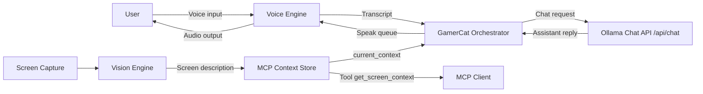
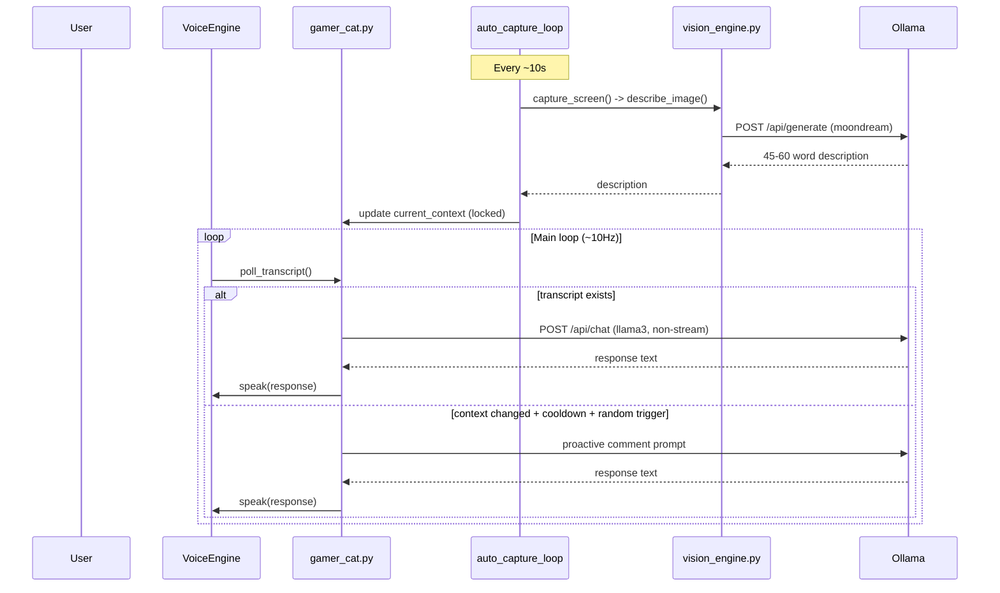

# Gamer-Cat Technical Documentation

## 1. System Overview
Gamer-Cat is a local-first, real-time game companion that combines:
- screen capture
- vision summarization
- speech-to-text
- local LLM response generation
- text-to-speech playback

Primary runtime target is Windows.

## 2. High-Level Architecture


## 3. Runtime Sequence


## 4. Module Responsibilities
| Module | Responsibility | Notes |
|---|---|---|
| `src/screen_capture.py` | Captures primary screen and returns base64 JPEG | JPEG quality set to `80` |
| `src/vision_engine.py` | Sends screenshot to Ollama vision endpoint | Uses `moondream`, low temperature, capped tokens |
| `src/mcp_server.py` | Maintains shared context + MCP tool exposure | `context_lock` protects shared state |
| `src/gamer_cat.py` | Main orchestration loop | Manages history, proactive logic, LLM calls |
| `src/voice_engine.py` | STT + TTS backend manager | Background listening and queued speech |

## 5. Concurrency Model
### Active Threads
- Main thread: orchestration loop in `gamer_cat.py`
- Capture thread: `auto_capture_loop()` updates screen context
- TTS thread: queue consumer in `VoiceEngine._tts_worker()`
- Listener thread (optional, enabled by default): `VoiceEngine._listen_worker()`

### Shared-State Safety
- `mcp_server.current_context` is guarded by `context_lock` for read/write consistency.
- Transcript flow uses a bounded queue (`maxsize=2`) to avoid unbounded memory growth.

## 6. Core Data Contracts
### Screen context
`mcp_server.current_context`:
```python
{
  "description": str,
  "timestamp": float
}
```

### LLM context memory
- `gamer_cat.py` keeps `screen_history = deque(maxlen=3)`.
- History is appended only when the description changes and is not placeholder text.

### STT acceptance criteria
- Transcript accepted only if:
  - text is non-empty
  - `info.language_probability > 0.4`

## 7. External Interfaces
### Ollama Chat API
- Endpoint: `http://localhost:11434/api/chat`
- Model: `llama3`
- Streaming: disabled (`stream: false`)

### Ollama Vision API
- Endpoint: `http://localhost:11434/api/generate`
- Model: `moondream`
- Prompt target: concrete visual details, 45-60 words
- Options:
  - `temperature: 0.1`
  - `num_predict: 120`

### MCP Tool
- Tool name: `get_screen_context`
- Returns: age + latest context description string

## 8. Voice Pipeline and Backend Selection
### STT
- Engine: `faster-whisper` (`tiny`, CPU `int8`)
- Input: 16kHz mono PCM chunks from PyAudio

### TTS backends
Configured via `GAMERCAT_TTS_BACKEND`:
- `piper`: offline neural (requires explicit model path)
- `edge`: edge-tts neural voice
- `powershell`: Windows `System.Speech`
- `pyttsx3`: local SAPI5
- `auto`: selection chain below

Auto selection order:
1. `piper` (only if model is configured)
2. `edge-tts` (one-time warning + disable on failure)
3. PowerShell `System.Speech` (Windows)
4. `pyttsx3`

## 9. Configuration Reference
| Variable | Purpose | Default |
|---|---|---|
| `GAMERCAT_TTS_BACKEND` | Force TTS backend (`auto`, `edge`, `piper`, `powershell`, `pyttsx3`) | `auto` |
| `GAMERCAT_TTS_VOICE` | edge-tts voice id | `ja-JP-NanamiNeural` |
| `GAMERCAT_TTS_RATE` | edge-tts speaking rate | `+18%` |
| `GAMERCAT_TTS_PITCH` | edge-tts pitch | `+7Hz` |
| `GAMERCAT_TTS_PIPER_EXE` | Piper executable path | `piper` |
| `GAMERCAT_TTS_PIPER_MODEL` | Piper model `.onnx` path | empty |
| `GAMERCAT_TTS_PIPER_CONFIG` | Piper `.json` config path | empty |
| `GAMERCAT_TTS_PIPER_LENGTH_SCALE` | Piper speed/length control | `0.95` |

## 10. Build, Setup, and Run
### Prerequisites
- Windows
- Ollama installed
- FFmpeg/`ffplay` available on PATH
- `uv` installed

### Model setup
```bash
ollama pull moondream
ollama pull llama3
```

### Python env setup
```bash
uv sync
```

### Run
```bash
ollama serve
uv run python src/gamer_cat.py
```

### Recommended anime voice preset (PowerShell)
```powershell
$env:GAMERCAT_TTS_BACKEND="edge"
$env:GAMERCAT_TTS_VOICE="ja-JP-NanamiNeural"
$env:GAMERCAT_TTS_RATE="+20%"
$env:GAMERCAT_TTS_PITCH="+8Hz"
uv run python src/gamer_cat.py
```

## 11. Operational Behavior
### Main loop cadence
- Main loop sleeps `0.1s` each cycle (~10Hz scheduling).
- Background screen capture updates every `10s`.

### Proactive comment logic
- Requires context change.
- Enforces 30s cooldown since last AI response.
- Random gate (`random.random() > 0.5`).

## 12. Observability
Important log prefixes:
- `[AutoCapture]` screen updates/errors
- `[AI Thinking]`, `[AI Responded]`, `[AI Error]`
- `[TTS Warning]`, `[TTS Worker Error]`
- `[Listen Error]`
- `[History Updated]`

## 13. Failure Modes and Recovery
| Symptom | Likely Cause | Mitigation |
|---|---|---|
| No AI replies | Ollama unavailable | verify `ollama serve`, model pulls, localhost access |
| Silent speech | TTS backend failure/device routing | force backend to `edge` or `powershell`; verify `ffplay` |
| Repeated STT mis-detection | ambient noise/language detection variance | improve mic quality, adjust capture duration, tune threshold |
| Empty screen context | capture/vision request failure | inspect `[AutoCapture]` logs and Ollama vision endpoint |
| High CPU usage | continuous STT + model inference | increase listen interval, lower proactive frequency, use smaller models |

## 14. Security and Privacy Posture
- No required cloud API keys for core operation.
- Primary inference endpoints are local Ollama HTTP services.
- Speech and screen data remain local unless optional third-party backends are chosen.
- `edge-tts` may involve network usage depending on backend implementation; use `piper` for fully offline TTS.

## 15. Repository Layout
```text
gamer-cat/
  assets/
    banners/
    source-images/
  docs/                 # GitHub Pages site
  notes/                # planning and session notes
  src/
    gamer_cat.py
    mcp_server.py
    screen_capture.py
    vision_engine.py
    voice_engine.py
  tests/
  DOCUMENTATION.md
  README.md
  HANDOFF.md
  pyproject.toml
  uv.lock
```

## 16. Known Gaps
- Limited automated test coverage for orchestration and concurrency behavior.
- No formal config validation layer for environment variables.
- No structured metrics export (only console logs).

## 17. Suggested Next Improvements
- Add integration tests with mock Ollama endpoints.
- Add configurable YAML/TOML runtime config file.
- Add structured logging with log levels and optional JSON output.
- Add watchdog/health endpoint for long-running sessions.
